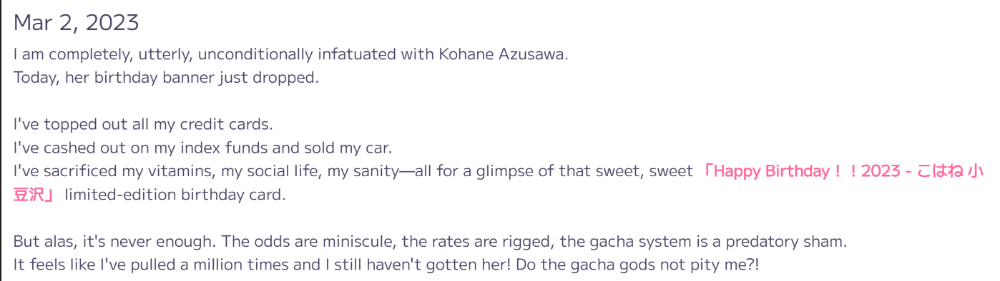
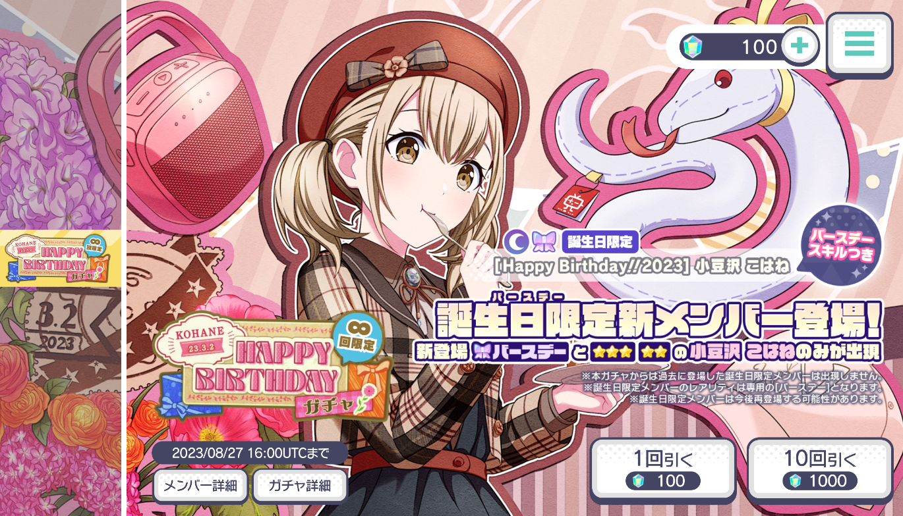
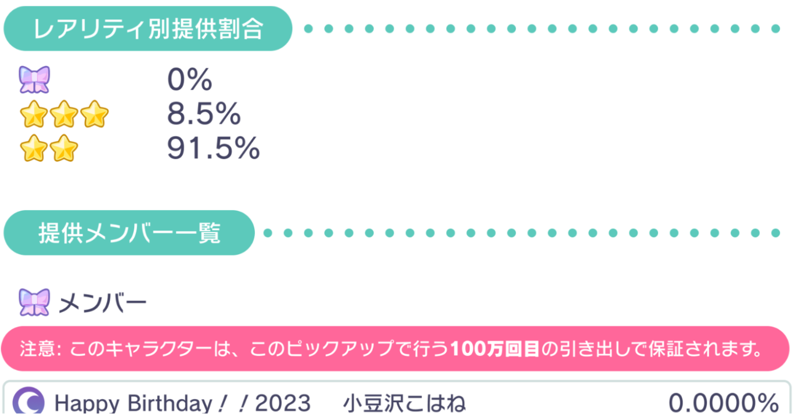
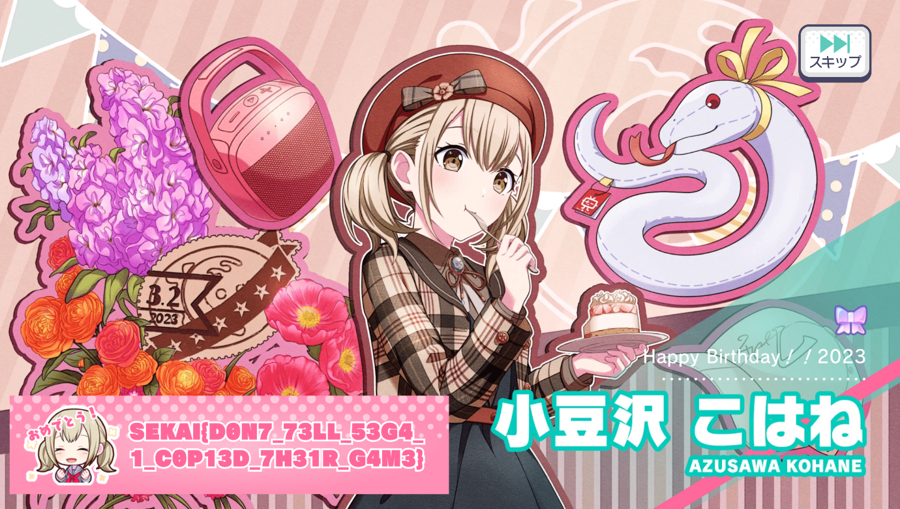
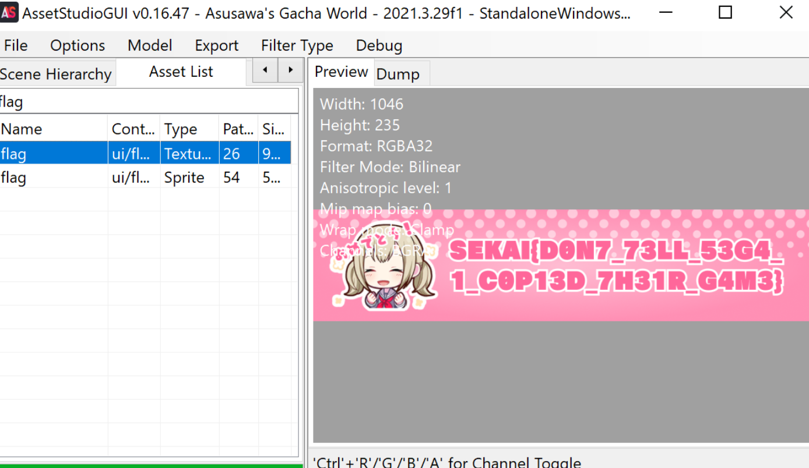

### Azusawa's Gacha World
https://azusawa.world/#/2023/03/02

Author: enscribe
---

[Given files](dist.zip)

We start with the following description of an unfortunate weeb.

After a brief flashback to previous Love Live gacha related trauma, we can look at our files to see that we have a Unity game on our hands. Upon boot, we are greeted with a gacha screen that any gacha veteran knows well.

Only enough gems for a single pull?! Sinful. Of course this doesn't stop me from pulling my one waifu. I get a summer edition card. Anyway, now out of gems, we investigate the rest of the page. Of course it is all in Japanese but this doesn't stop a gacha game virtuoso so I pull out my handy google translate on my phone and begin reading. 

... harsh. That is a 0% rate right there. Fortunately, this game has a pity system, unfortunately, that pink banner there says that the pity only kicks in at 1 million pulls.. 

At this point I remember that this is a reversing challenge so this means either we need to change the rates to 100% or add enough gems to pull 1 million times. At this point, I also had the thought that clearly the flag will be included on the card, so perhaps we could just extract the assets like a dataminer whenever a new update releases?

I first looked into my second approach, after some googling I found that a program called AssetStudio `https://github.com/Perfare/AssetStudio` is capable of extracting assets from unity games. So I pointed it to the `Asusawa's Gacha World_Data` folder and let it go (after turning off error messages in the debug menu!). However, the program was frequently not responding and seemed to be taking a while so I left it going in the background and moved on to doing this the reversing way.

After looking into how to hack a unity game, I found that I could use a tool called dnspy `https://github.com/dnSpy/dnSpy` (this tool is actually no longer maintained but worked for this challenge) on the `Asusawa's Gacha World_Data\Managed\Assembly-CSharp.dll` file where the source code can be decompiled from. 

Ill spare you reading about everything I looked at and keep this relevant. Opening the dll in dnspy, we can look in the `-` namespace to find the relevant code. I first tried changing the start function to set the pull number in the gameState class to 1 million but since dnspy decompiles to its best approximation of C# code, the code in the start function was now invalid and I couldn't get any changes to compile and save. Instead, I found the spendCrystals function and changed it from:
```
public void SpendCrystals(int numPulls){    
    this.crystals -= ((numPulls == 1) ? 100 : 1000);    
    this.pulls += numPulls;  
}
```
to 
```
public void SpendCrystals(int numPulls)  
{
    this.crystals -= ((numPulls == 1) ? 0 : 0);
    this.pulls += 999999;  
}
```
So that the crystals will no longer decrease when pulling and so a single pull will increment the pity tracker by 999,999 instead of 1. We can then save the module (ctrl+shift+s) and reopen our gacha game. 

Now, we can pull as much as we want! Truly the dream. So our first single pull will get us a random waifu while the second one will get us the elusive birthday waifu! But, for some reason, I didn't get an animation when I pulled her and I can't click on her portrait to view the full card.. strange. After trying a few more times I realised that I am an idiot, based on pure muscle memory, I kept clicking the skip animation button on the first pull which then skipped the animation for the birthday pull... 

So, I learnt how to get some patience and did not click the skip button this time and was able to see our wonderful birthday waifu and, as expected, our flag!

This is the point where I closed my email to SEGA since they asked so nicely. 

Also, as a side point, at some point during this, asset studio did finish ripping the assets from the game and confirmed that it can also get the flag by searching for the flag file in its results.

